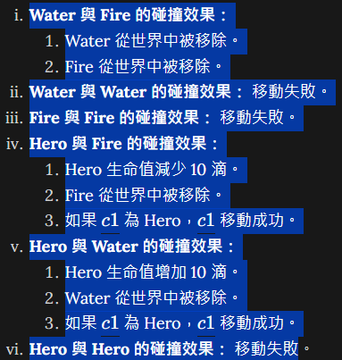

# Collision Detector

## Game process
    - Initial world
        - random 10 sprite with different initial location
    - get input of x1 and x2
    - collision detector check if there's another sprite on x2 and handle move 
    - different sprite, different results
    - repeat: while still have sprite in world

## Chain of responsibility
    - each collision have it's own handler.
    - check next handler

## Key Results
1. Initial the world
    - random 10 sprites
    - 10 sprites have no same location
2. Move and collision
    - move(int x1, int x2), check handler
    - handler deal with different collision
    - update hero's hp
3. Test

## Could be improved
1. Dictionary to check the sprites?
2. Test cases?
3. Error messages?

## Collision

## Design of collisionHandler
1. 定義一個 CollisionHandler 抽象類別，並讓具體的碰撞處理器繼承這個類別。
2. 在 World 類別中添加 move 方法，該方法會調用責任鏈來處理碰撞。
3. 修改 Main 類別來使用新的 move 方法。